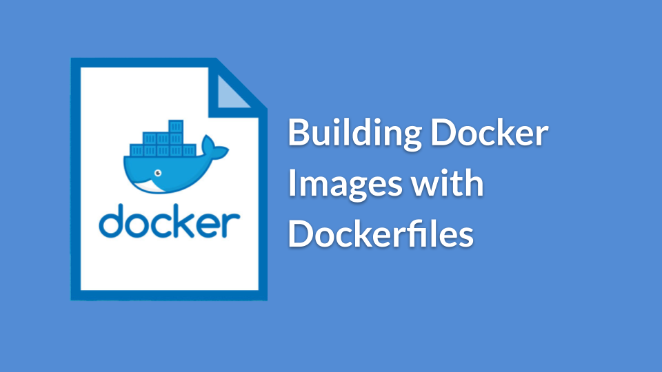

# Docker Hands-on Workshops
## Create Images

xxx

# 環境を作る
## step2: 環境を作る
### Dockerfile
### 挙動を把握する
### 作ってみる
### 起動してログを見る
### 入ってみる

[戻る](/docker/002-UseImage/) [Dockerハンズオン](..)　　[進む](/docker/004-KnowVolatility/) 