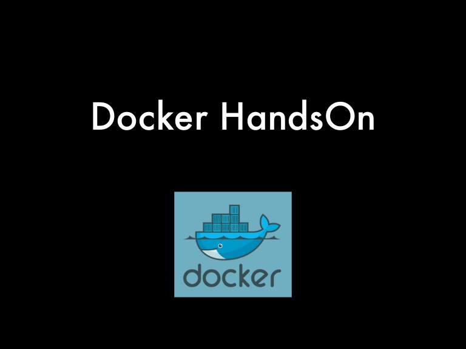

# Docker Hands-on Workshops

xxx

# Dockerハンズオン総合案内

| Title | Description | Learning Time | Teaching Time With Discussion | 
| :------- | :---------- | :-- | :-- |
| [事前準備](tree/master/docs/001-Preparation)  | このワークショップでは、Dockerコンテナを稼働させるためのホストサーバをAWS上に用意します。CloudFormationを利用して宣言的に環境を構築します。ホストにSSH接続するため各自が利用している公開鍵を事前に提供してください。 | 10 min | 20 min |
| [環境を使う](tree/master/docs/002-UseImage)  | 様々なOSSミドルウェアについて、Dockerイメージを取得し手軽にサービスを立ち上げる体験をします | 10 min | 20 min |
| [環境を作る](tree/master/docs/003-CreateImage)  | このワークショップでは、This workshop demonstrates client side encryption with data key caching using the python encryption sdk | 10 min | 20 min |